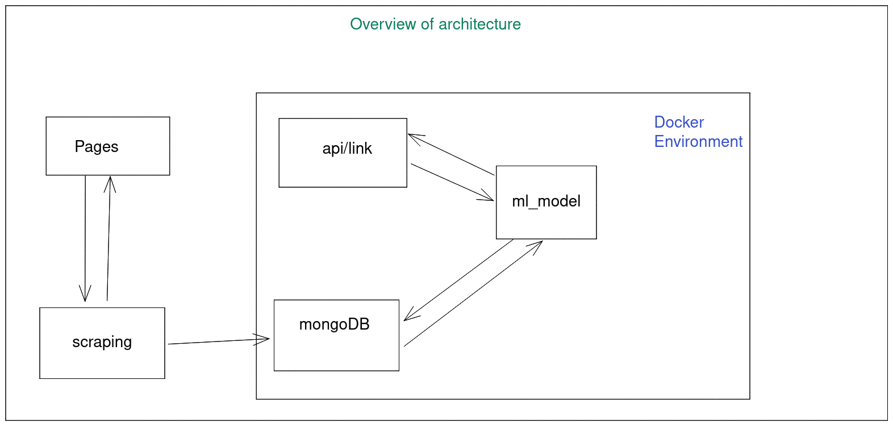

# Prediction based on web page characteristics

An architecture capable of collecting, storing and making available information in the context of data extraction from Web pages was implemented in this repository.
  
Technologies used:
- Docker
- Docker-composer
- MongoDb
- FastAPI
  
--------------  

# Setup

Prerequisites
- Docker
- Docker-compose
- Python >= 3.7.1
- Virtualenv >= 20.0.35

--------------  

# Deploy  

1. Clone this repository ( `'$ git clone https://github.com/romulovitor/ml-technical-challenge.git '` )  
2. Get in the project ( `'$ cd ml-technical-challenge '`)  
3. Run to create the environment of development  (`'$ make install '`)  
4. Activate the virtual dependencies (`'$ source venv/bin/activate '`)
5. Make the environment API (`'$ make api '`)
6. Make the infrastructure to run the application (`'$ make up'`)
7. Run in the terminal (`'$ python scraping.py -l 'https://en.wikipedia.org/wiki/Algorithm'  -d 15 '`)  
8. Run the model random forest using API type in your browser this http://0.0.0.0/prediction/?link=https://en.wikipedia.org/wiki/Algorithm

PS: Scraping -> To extract new characteristics  of a link just change the following parameters: **-l** (new link) **-d** (how depth)
Prediction -> To make a new prediction just change the parameter http://0.0.0.0/prediction/?link=(new_link) on the browser url

--------------  

# Architecture

The architecture was divided into modules for better organization of information. As presented in an image, illustrating in a macro way how the communication between the components of the architecture occurs
